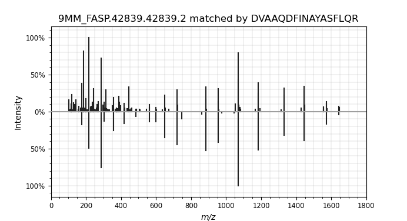

# Mistle Example Usage

A toy example is provided to test the program. A library of simulated mass spectra (predicted by Prosit) of 1000 yeast peptides is used for reference. 3 experimental spectra matching the species are retrieved from 9MM FASP dataset (Study )

## Commands

Open terminal or change into this example directory. To construct the fragment index from the example spectral library, run

    mistle-build -i yeast_1000.msp -o index/ -n 4 -t 1
    
This should create 4 index partitions (binary format) in the index directory, a precursor index file, and a human-readable config.txt.

Next, perform example searches
    
    mistle-search -s yeast_exp.mgf -i index/ -o example_results.csv -p 10 -b 0.2 --hits_per_spectrum 1

This should produce a *example_results.csv* file in the index directory. Compare the output to the *example_results_control.csv*, which is already present in the index/ directory. If they align, *mistle* is configured correctly and is read to use. (Note that floating-point inaccuracy may occur when using different hardware or advanced vector extensions. Results may deviate from the control in the last digit(s)).

Below, the first match of the list is displayed as mirror plot (experimental spectrum top; matched simulated spectrum bottom) using the python *spectrum_utils* package.

