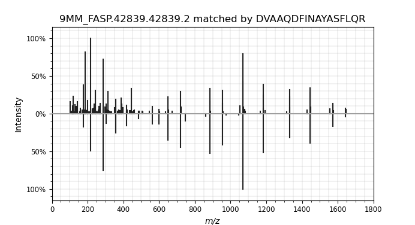

# Mistle Example Usage

A toy example is provided to test the program. A library of 1000 simulated mass spectra (predicted by Prosit (Gessulat et al., 2019)) of yeast peptides (*Saccharomyces cerevisiae*) is used for reference. 3 experimental spectra matching the species are selected from the 9MM FASP dataset (Tanca et al., 2013).

## Running the test

Open terminal or change into this directory (path/to/mistle/example). Create a new directory for the index with *mkdir index*. To construct the fragment index from the example spectral library, run

    mistle-build -i yeast_1000.msp -o index/ -n 4 -t 1
    
This should create 4 index partitions (binary format) in the index directory, a precursor index file, and a human-readable config.txt. Note that if the PATH to mistle-build and mistle-search is not exported, the user is required to specify the executables (e.g. */path/to/mistle/build/mistle-build [...]*).

Next, perform example searches
    
    mistle-search -s yeast_exp.mgf -i index/ -o example_results.csv -p 10 -b 0.2 -t 1 --hits_per_spectrum 1

This should produce an *example_results.csv* file in the current directory. Compare the output to the *example_results_control.csv*, which already resides in this directory. If they align, *mistle* is configured correctly and is read to use. (Note that floating-point inaccuracy may occur when using different hardware or advanced vector extensions. Results and scores may deviate from the control in the last digit(s)).

Below, the first match of the list is displayed by a mirror plot (experimental spectrum top; matched simulated spectrum bottom) generated using the python *spectrum_utils* package.

